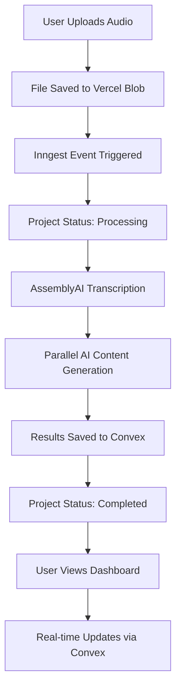
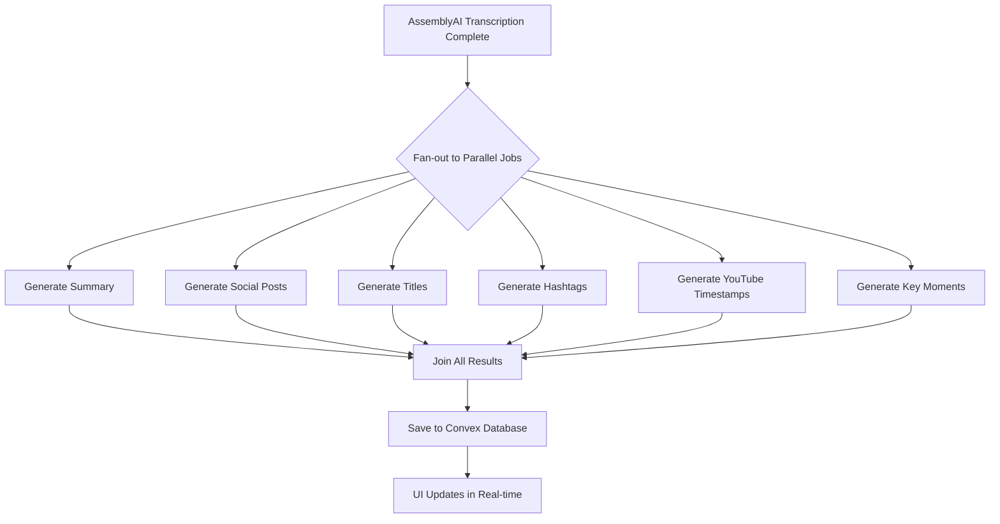
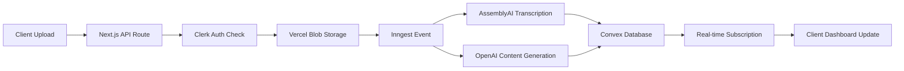

# PodSens - AI Podcast Post-Production Platform


---

### Summary

**PodSens** is an end-to-end AI-powered platform designed to automate podcast
post-production workflows. The system transforms a single audio file upload into
a comprehensive multi-platform content distribution package, reducing manual
content creation time from hours to minutes.

---

### ⚡ Technical Highlight

**Parallel AI processing with Inngest (5x faster than sequential)**

Instead of waiting 5 minutes for AI tasks to run one-by-one, we run 6 AI
generation jobs simultaneously. Your content is ready in ~90 seconds total.

---

## 🤔 What Is This App?

Here's the simple explanation:

1. **You upload** one audio file (your podcast episode)
2. **AI analyzes** your content, understanding speakers, topics, and key moments
3. **You get** a complete content distribution package:
   - Summary with key insights
   - Social media posts tailored for Twitter, LinkedIn, Instagram, TikTok,
     YouTube, and Facebook
   - Title suggestions (short, long, SEO-optimized)
   - Platform-specific hashtags
   - YouTube chapter timestamps
   - Key moments for viral clips
   - Full transcript with speaker identification

**The workflow:** Record → Upload → AI Analyzes → Get Distribution Content

---

## ✨ Features

### For Podcast Creators

- **📝 AI Summary** - Comprehensive overview with bullets, key insights, and
  TLDR
- **📱 Social Posts** - Platform-optimized copy for 6 networks:
  - **Twitter** - 280 chars, punchy and engaging
  - **LinkedIn** - Professional tone, thought leadership
  - **Instagram** - Visual hooks with engagement questions
  - **TikTok** - Casual, trend-aware, Gen-Z friendly
  - **YouTube** - Description with CTAs and timestamps
  - **Facebook** - Community-focused conversation starters
- **🎯 Title Suggestions** - 4 different styles for every use case:
  - YouTube Short (catchy, under 60 chars)
  - YouTube Long (descriptive, SEO-friendly)
  - Podcast Titles (episode-focused)
  - SEO Keywords (discoverability)
- **#️⃣ Hashtags** - Platform-specific tags optimized for reach
- **⏱️ YouTube Timestamps** - Auto-generated chapter markers for better
  navigation
- **🎤 Key Moments** - AI identifies viral clip opportunities with timestamps
- **👥 Speaker Diarization** - "Who said what" with speaker labels and
  confidence scores

### Technical Features (The Smart Stuff)

- **⚡ Parallel AI Processing** - 6 AI jobs run simultaneously (60s total vs
  300s sequential)
- **🔄 Real-time Updates** - See progress live with Convex subscriptions (no
  polling)
- **🛡️ Durable Workflows** - Inngest automatically retries failed steps (no lost
  work)
- **📊 Plan-based Feature Gating** - Features unlock based on subscription tier
  (Free/Pro/Ultra)
- **🎨 Dark Mode Support** - Beautiful UI that adapts to your preference
- **📦 Type-safe Throughout** - End-to-end TypeScript
- **🔐 Secure by Default** - Clerk authentication with row-level security

---

## 🔧 How It Works

### User Flow



**Performance Notes:**

- Transcription: ~30-60 seconds
- AI Content Generation (parallel): ~60 seconds
- **Total Processing Time: ~90-120 seconds**

---

### Parallel AI Processing Architecture



**Why This Matters:**

- **Sequential**: 6 jobs × 50s each = ~300 seconds (5 minutes)
- **Parallel**: All jobs run simultaneously = ~60 seconds
- **Result**: 5x faster processing

---

### Data Architecture



---

## 🛠️ Setup & Configuration

### Installation Steps

1. **Clone the repository**

```bash
git clone https://github.com/rohanwani10/PodSens-AI-Podcast-Post-Production-Platform.git

cd PodSens-AI-Podcast-Post-Production-Platform
```

2. **Install dependencies**

```bash
npm install
```

3. **Set up environment variables**

```bash
cp .env.example .env.local
```

Then fill in all the required keys in `.env.local` (see Environment Variables
section below).

4. **Start Convex development database**

```bash
npm run convex dev
```

This will:

- Create a new Convex project (or connect to existing)
- Set up your database schema
- Generate TypeScript types
- Start watching for changes

5. **Start the development server** (in a new terminal)

```bash
npm run dev
```

6. **Open your browser**

Navigate to `http://localhost:3000`

---

### Service Configuration

#### 1. Clerk Setup (Authentication & Billing)

1. Go to [Clerk Dashboard](https://go.clerk.com/sonny)
2. Create a new application
3. Copy your publishable and secret keys to `.env.local`
4. **Enable Billing**:
   - Go to "Billing" → "Subscriptions"
   - Create three plans: `free`, `pro`, `ultra`
   - Set prices: Free ($0), Pro ($29/mo), Ultra ($69/mo)
5. **Configure Features** (match these identifiers):
   - `summary` (Free, Pro, Ultra)
   - `social_posts` (Pro, Ultra)
   - `titles` (Pro, Ultra)
   - `hashtags` (Pro, Ultra)
   - `youtube_timestamps` (Ultra only)
   - `key_moments` (Ultra only)
   - `speaker_diarization` (Ultra only)

#### 2. Convex Setup (Real-time Database)

1. Go to [Convex Dashboard](https://convex.dev)
2. Create a new project
3. Copy your deployment URL to `.env.local`
4. The schema will auto-deploy when you run `pnpm convex dev`

#### 3. Vercel Blob Setup (File Storage)

1. Go to [Vercel Dashboard](https://vercel.com)
2. Create a new project (or use existing)
3. Go to "Storage" → "Create Database" → "Blob"
4. Copy the `BLOB_READ_WRITE_TOKEN` to `.env.local`

#### 4. Inngest Setup (Workflow Orchestration)

1. Go to [Inngest Dashboard](https://www.inngest.com/)
2. Create a new app
3. Copy your Event Key and Signing Key to `.env.local`
4. In development, Inngest will auto-discover your functions

#### 5. AssemblyAI Setup (Transcription)

1. Go to [AssemblyAI Dashboard](https://www.assemblyai.com/dashboard)
2. Create an account (free tier available)
3. Copy your API key to `.env.local`
4. **Pricing**: ~$0.00025/second (~$0.65 per hour of audio)

#### 6. Gemini Setup (AI Content Generation)

1. Go to [Gemini Platform](https://gemini.google.com)
2. Create an API key
3. Copy your API key to `.env.local`
4. **Model Used**: `gemini-3-preview`

---

## 📊 Database Schema Overview

### Main Model: `projects` Table

The entire application revolves around a single `projects` table in Convex. This
denormalized structure allows for atomic updates and real-time reactivity.

**Key Fields:**

| Field               | Type   | Description                                                 |
| ------------------- | ------ | ----------------------------------------------------------- |
| `userId`            | string | Clerk user ID (links project to user)                       |
| `inputUrl`          | string | Vercel Blob URL for uploaded file                           |
| `status`            | enum   | `uploaded` → `processing` → `completed` or `failed`         |
| `jobStatus`         | object | Granular status for `transcription` and `contentGeneration` |
| `transcript`        | object | Full transcript with segments, speakers, chapters           |
| `summary`           | object | AI-generated summary with bullets, insights, TLDR           |
| `socialPosts`       | object | Platform-specific posts (Twitter, LinkedIn, etc.)           |
| `titles`            | object | Title suggestions (YouTube, podcast, SEO)                   |
| `hashtags`          | object | Platform-specific hashtag recommendations                   |
| `youtubeTimestamps` | array  | Chapter markers for YouTube descriptions                    |
| `keyMoments`        | array  | Viral clip opportunities with timestamps                    |

**Design Decisions:**

- **Denormalized structure** - All data in one document for atomic updates
- **Optional fields** - Allow progressive population as Inngest jobs complete
- **Indexes** - Optimize queries by user, status, and creation date
- **Real-time reactivity** - Convex subscriptions trigger UI updates
  automatically

**Indexes:**

- `by_user` - List all projects for a user
- `by_status` - Filter by processing status
- `by_user_and_status` - User's active/completed projects
- `by_created_at` - Sort by newest first

---

## 🚀 Deployment

### Vercel Deployment (Recommended)

1. **Push your code to GitHub**

```bash
git add .
git commit -m "Initial commit"
git push origin main
```

2. **Import to Vercel**

- Go to [Vercel Dashboard](https://vercel.com)
- Click "Import Project"
- Select your GitHub repository
- Vercel will auto-detect Next.js

3. **Add environment variables**

In Vercel dashboard → Settings → Environment Variables, add all variables from
your `.env.local`

4. **Deploy**

Vercel will automatically deploy on every push to `main`

5. **Configure custom domain** (optional)

Settings → Domains → Add your domain

---

### Monitoring & Observability

Keep an eye on these dashboards:

- **Inngest Dashboard** - Workflow execution logs, retry attempts, failures
- **Convex Dashboard** - Database queries, performance metrics, real-time
  connections
- **Vercel Analytics** - Traffic, page views, edge function performance
- **Clerk Dashboard** - User signups, active subscriptions, billing events

---

### Important Concepts

**Plan-based Feature Gating**

Features are enabled based on the user's Clerk subscription tier:

- **Free**: Summary only (3 projects lifetime)
- **Pro**: + Social posts, titles, hashtags (30 projects/month)
- **Ultra**: + YouTube timestamps, key moments, full transcript (unlimited)

**Parallel AI Processing**

Instead of running AI generation tasks sequentially (slow), Inngest runs 6 jobs
in parallel using `Promise.allSettled`. This reduces processing time from ~5
minutes to ~60 seconds.

**Real-time Updates**

Convex subscriptions (`useQuery`) automatically re-render components when
database data changes. No polling, no manual refetching. As Inngest updates the
project status, the UI updates instantly.

**Durable Execution**

Inngest provides automatic retry logic. If OpenAI times out or AssemblyAI fails,
the step retries with exponential backoff. Your users never lose work.
